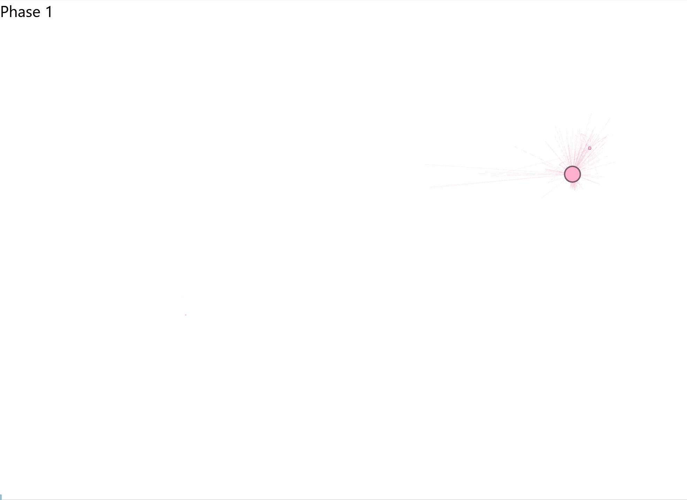

```{r setup, include=FALSE}
knitr::opts_chunk$set(echo = FALSE)
```

```{r Chargement et manipulation des donnée, include=FALSE, cache=TRUE}
# Une description de chaque script se trouve dans les fichiers en question
source("./scripts/load_data.R")
source("./scripts/tweets_data_preparation.R")
source("./scripts/create_network_data.R")
source("./scripts/community_analysis.R", encoding = "UTF-8")
source("./scripts/create_dynamic_network_data.R", encoding = "UTF-8")
```

## Contexte

Il y a quelques semaines, le planning familial a été victime de nombreuses attaques, [allant jusqu'à la dégradation de locaux et les menaces téléphoniques](https://www.mediapart.fr/journal/france/240822/affiche-du-planning-familial-ce-n-est-pas-une-question-de-genre-c-est-une-question-de-droit). La cause ? Une affiche publiée le 17/08/2022 montrant un homme enceint.

{width="354"}

Les réactions se sont rapidement multipliées sur les réseaux sociaux, entre soutiens au planning familial et virulentes attaques à l'encontre de ce dernier et des personnes transgenres. Le planning familial, de son côté, a publié un communiqué sur Twitter le 19/08/2022 pour dénoncer les attaques de l'extrême droite contre cette campagne de communication. 

<blockquote class="twitter-tweet">

<p lang="fr" dir="ltr">

⚠️ 🗣 Suite aux attaques de l'extrême droite que subissent <a href="https://twitter.com/leplanning?ref_src=twsrc%5Etfw">@leplanning</a> et ses militant•es notre association prend la parole et lance un appel à soutien ⤵️ <a href="https://t.co/ggSCZtHRuE">pic.twitter.com/ggSCZtHRuE</a>

</p>

--- Le Planning Familial (@leplanning) <a href="https://twitter.com/leplanning/status/1560617964583395330?ref_src=twsrc%5Etfw">August 19, 2022</a>

</blockquote>

```{=html}
<script async src="https://platform.twitter.com/widgets.js" charset="utf-8"></script>
```

Suite à cela, de nombreuses voix se sont élevées pour protester contre l\'assimilation à l\'extrême-droite des opposant·e·s à l\'affiche du planning familial. Dans le même temps, [plusieurs](https://www.arretsurimages.net/articles/planning-familial-les-anti-trans-cautions-progressistes-des-reacs) [articles ](https://www.liberation.fr/societe/sexualite-et-genres/entre-feministes-terf-et-extreme-droite-des-passerelles-ideologiques-pour-un-meme-combat-antitrans-20220912_KDJZLO3HVJFINFJRDMEU3AEGV4/)sont sortis pour pointer du doigt la connivence idéologique entre féministes anti-trans (également appelées TERFs) et l\'extrême droite. 

> Alors, peut-on être opposé·e à l\'affiche du planning familial sans être d\'extrême droite ? J\'ai tenté de répondre à cette question en analysant les données issues de Twitter. 

## Quelques rudiments d\'analyse de réseau social

La polémique s\'étant propagée à partir de Twitter, il semblait logique de chercher à analyser les données de ce réseau social pour mieux la comprendre. Avant de passer aux résultats de cette analyse, quelques rapides explications méthodologiques s\'imposent. Pour éviter de tirer en longueur, je me contenterai ici des explications minimales. N\'hésitez pas à m\'interpeller sur Twitter pour plus de détails. En outre, pour celleux que cela intéresserait, les données et les scripts ayant permis l\'analyse sont disponibles dans un dépôt [sur GitHub](https://github.com/MaxenceOuafik/TERFnet/). 

[{width="666"}](https://unsplash.com/photos/5VJLeQ-TrKs)


Dans sa forme la plus simple, un réseau est composé de points, appelés les nœuds, connectés entre eux par des liens. Dans le cadre d\'une analyse de réseau sur Twitter, les nœuds sont généralement des utilisateur·ice·s tandis que les liens peuvent représenter différentes relations : abonnements, like, retweets, mentions, etc.

Pour cette analyse, j\'ai choisi d\'analyser uniquement les retweets. En effet, [il s\'agit de la forme d\'interaction la plus emblématique de Twitter et un bon reflet d\'une proximité idéologique, dans la mesure où l\'on retweet des contenus avec lesquels on est globalement en accord](http://dl.acm.org/citation.cfm?doid=2024288.2024326). Je précise ici que je n\'ai pas pris en compte les Tweets cités, puisqu\'il est fréquent de citer un tweet pour marquer son désaccord, là où le retweet simple tend à montrer que l\'on approuve le contenu. J\'aurais pu choisir d\'analyser les likes, mais les retweets ont également une fonction d\'amplification du contenu et de propagation de l\'information qu\'il était pertinent de prendre en compte pour comprendre comment la polémique s\'était étendue. 

De plus, une propriété intéressante des réseaux sociaux est la formation de communautés, c\'est-à-dire des ensembles d\'utilisateur·ice·s plus densément connecté·e·s entre elleux qu\'avec le reste du réseau. Dans le cadre de cet article, l\'analyse de communauté permettait de déterminer des groupes partageant une idéologie commune, puisqu\'ayant beaucoup tendance à se retweeter entre eux. Pour ce faire, [je me suis inspiré d\'une étude qui avait analysé le réseau de retweets des membres du Parlement Européen](https://appliednetsci.springeropen.com/articles/10.1007/s41109-016-0001-4). Plus précisément, je me suis servi du même algorithme de détection des communautés qu\'elleux, l\'algorithme de Louvain. Ce dernier leur avait permis de déterminer le parti politique des membres du Parlement Européen avec une précision de 84%, sur simple base de leurs retweets. 

## Le réseau de la discorde

Pour créer ce réseau, j\'ai récolté **50 264 tweets** publiés entre le **16/08/22** et le **26/08/2022**.Ces tweets ont été identifiés en utilisant les mots-clés \"planning familial\" ainsi que le hashtag \"#PlanningFamilial\". Ils ont été rédigés par **25 739 utilisateur·ice·s différent·e·s**. 

Pour gagner en lisibilité, j\'ai exclu les comptes qui n\'étaient liés à aucun autre compte du réseau, ce qui a laissé un total de **21 677** utilisateur·ice·s connecté·e·s par **38 213** retweets. Le réseau a ensuite été généré en utilisant [l\'algorithme *ForceAtlas2*](https://dx.plos.org/10.1371/journal.pone.0098679). Dans cette méthode de visualisation, les nœuds se repoussent mutuellement mais sont attirés par leurs liens, à savoir leurs retweets. En d\'autres termes, les utilisateurs qui sont les plus proches idéologiquement sont également les plus proches sur le réseau. **J\'insiste ici sur le fait que le positionnement des nœuds ne relève pas d\'un choix arbitraire de ma part, mais d\'une solution optimale calculée par un algorithme.** Par ailleurs, j\'ai paramétré le réseau pour que la taille des nœuds représente leur nombre retweets, les plus gros nœuds correspondant aux comptes les plus retweetés. Enfin, la couleur de chaque nœud dépend de sa communauté. 


Un rapide coup d\'œil sur ce réseau permet de constater son extrême polarisation ; deux camps se détachent très nettement l\'un de l\'autre. Les nœuds roses et oranges à la droite du réseau représentent les militant·e·s féministes et LGBTQIA+ ainsi que les personnalités et groupe de gauche tels que la CGT ou Philippe Poutou. La gauche du graphique, de son côté, représente tous les adversaires de l\'affiche: les néoconservateurs, dont les TERFs, en orange, l\'extrême-droite en rose, avec fdesouche ou Sardine Ruisseau, l\'alt-right en turquoise, avec le compte de Reconquête, le parti d\'Eric Zemmour, la droite réactionnaire en kaki, représentée par le Figaro, le Rassemblement National en vert, avec divers députés et porte-parole, et les conspirationnistes identitaires en bleu, dont André Bercoff. 

Entre ces deux pôles, on retrouve le centre, composé majoritairement de médias grand public, allant de Libération, proche de la gauche à BFMTV, proche de la droite et de l\'extrême-droite. Pour mieux comprendre le graphe et l\'analyser à votre tour, je vous invite à vous rendre sur [sa version interactive en ligne](https://maxenceouafik.github.io/DynamicGraph/). Vous pourrez y voir le nom de chaque nœud du réseau, chercher des utilisateur·ice·s et, d\'un clic sur un nœud, isoler tous les comptes ayant retweeté ou ayant été retweeté par ce compte, voir à quelle communauté appartient ce compte, ainsi que son nombre de tweets et de retweets. 

> Ce que montre ce réseau, c\'est que le débat est divisé en deux camps bien tranchés, les pro- et les anti-affiche. On ne peut ignorer par ailleurs que la majorité des anti-affiche sont d\'extrême-droite et que les autres sont fort proches de celle-ci sur cette question, comme en témoigne la porosité entre les néoconservateurs et l\'alt-right, unis par une même détestation du \"wokisme\". 

Si l\'on zoom sur le graphique, cette porosité devient évidente, avec des points oranges, les néoconservateurs, qui gravitent à proximité des gros comptes de la fachosphère, et des comptes de la fachosphère qui gravitent à proximité des comptes néoconservateurs. 


## 
Une tragédie en 5 actes

Pour bien comprendre la dynamique de propagation de l\'information, j\'ai créé un GIF qui permet de voir le réseau se développer au fil du temps. 



La première phase correspond au tweet initial de LaurierTheFox, le concepteur de l\'affiche. Ce dernier est rapidement retweeté par l\'alt-right qui s\'empare du sujet dans la phase 2, via les comptes de Gabrielle Cluzel, rédactrice en chef de Boulevard Voltaire, Laurence Trochu, du parti Reconquête ainsi que le compte officiel de Reconquête. Peu après, Marguerite Stern amplifie la polémique en retweetant des comptes qui gravitent autour de l\'alt-right, ce qui initie la phase 3. Dans la phase 4, les comptes de gauche se réveillent, avec principalement Philippe Poutou qui prend la défense du planning contre l\'extrême-droite. Dans le même temps, le réseau d\'extrême-droite se développe et se diversifie. Enfin, la phase 5 correspond à l\'entrée en scène du Figaro, et à la stabilisation du réseau. **On peut donc constater en direct le rôle des TERFs dans l\'amplification d\'une polémique transphobe initiée par l\'extrême-droite la plus abjecte.** Ceci confirme donc le rôle des TERFs dans la propagation des propos d\'extrême droite, à partir d\'une base commune fondée sur la transphobie et la rigidité de l\'assignation de genre. 

## Les différentes communautés passées à la loupe

Le tableau ci-dessous résume les différentes communautés identifiées dans le réseau, avec leur code couleur, le nombre de comptes au sein de la communauté, en valeurs absolues et en pourcentage, le nombre de tweets, ainsi que le nombre de retweets. J\'ai également calculé l\'indice **rRT**, qui correspond au nombre de retweets divisés par le nombre de tweets totaux. Cette [mesure permet d\'estimer l\'influence](http://dl.acm.org/citation.cfm?doid=2024288.2024326) d\'une communauté en regardant la proportion de tweets qui génèrent un engagement au sein de l\'audience. 

```{r Table, echo=FALSE, message=FALSE, warning=FALSE}
community_DT
```

Que retenir de ce tableau ? Pour commencer, on constate que 60% des gens s\'étant exprimés sur le sujet appartiennent à une communauté hostile au planning familial. La droite et l\'extrême-droite ont donc dominé l\'espace médiatique sur les réseaux sociaux. Les personnalités et groupes de gauche ne représentent que 6% des comptes, ce qui démontre un manque de mobilisation de la gauche sur les thématiques liées aux transidentités. Manque de mobilisation qui se constate également à leur retard pour intervenir, comme visualisé sur le graphique animé. 

En outre, on retrouve une plus grande fragmentation des groupes d\'extrême-droite en de multiples communautés, ce qui correspond à l\'atomisation croissante de l\'extrême-droite, déjà mise en avant par[ La Horde](https://lahorde.samizdat.net/Cartographie-de-l-extreme-droite-francaise-mise-a-jour-janvier-2022). Or, malgré cette explosion de l\'extrême-droite en de multiples groupuscules, **il est préoccupant de constater que la transphobie est un terreau commun pour ces mouvements, et que ledit terreau est suffisamment fertile que pour que leurs discours soit amplifié en dehors de leurs cercles, via les néoconservateurs.** On retrouve dans cette dernière communauté les TERFs, dont Marguerite Stern et Dora Moutot, ainsi que le magazine Marianne, qui leur avait offert une tribune, et Charlie Hebdo, qui s\'était fendu d\'une réaction transphobe. 

Enfin, quand on compare le nombre de tweets rédigés par rapport au nombre de retweets suscités, on constate clairement que la gauche et les militant·e·s féministes/LGBTQIA+ manquent d\'influence. Si on classe le tableau par rRT plutôt que par nombre de tweets, les militant·e·s passent du groupe le plus important au 5ème groupe le plus influent. **En d\'autres termes, malgré notre nombre, nous manquons d\'influenceur·se·s capables de générer un grand nombre de retweets et d\'amplifier nos discours**. 

## Pour conclure

Les thématiques liées aux transidentités divisent l\'opinion en deux parts, avec les forces progressistes d\'une part et les réactionnaires de l\'autre. Ce qui est préoccupant, dans cet agencement, c\'est que les forces conservatrices prennent actuellement plus de place et entraînent des convergences malgré des différences idéologiques parfois majeures entre leurs différents groupes. **Il y a un vrai risque à ce que cette convergence idéologique se traduise par un recul des droits, comme c\'est déjà le cas aux USA**.

Alors, peut-on être opposé à l\'affiche du planning familial sans être d\'extrême-droite ? **Oui, mais pas sans en être proche.** Et cette proximité se paie par une amplification de leurs discours et une normalisation de leurs propos, lesquels restent extrêmement violents et menaçants pour les droits sexuels et reproductifs dans leur ensemble. 

Se définir comme féministe ou de gauche en revendiquant une idéologie transphobe est un positionnement impossible à tenir, comme démontré sans ambiguïté par ce graphe. Cette proximité entre extrême-droite et transphobie est réelle et elle est observable ; il ne s\'agit pas d\'un argument rhétorique des *\"wokistes\"* pour décrédibiliser les gens qui pensent différemment d\'elleux.

À un moment, il s\'agira donc de choisir ses allié·e·s avec soin. 

###  
